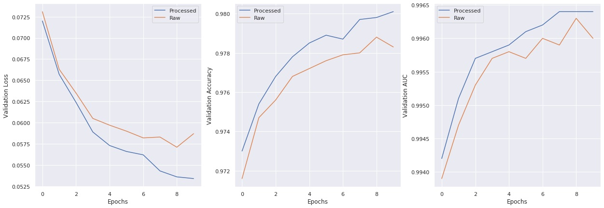

Dataset(Sejong corpus) can be downloaded at:  
https://drive.google.com/file/d/1dSfw9F2-XHMz6Zv6NpIZEYa50L0kRpBe/view?usp=sharing

Dataset provided is processed so that every line
has approximately 200 characters to fit the default model configuration. 

## Quick notes on the dataset
When creating a custom dataset, we found that concatenating shorter sentences into a single line can help 
reduce training time without hurting the performance.  

To demonstrate this, we randomly sampled 300 text files from the corpus for training(351,374 lines). 
The same files were processed with the script(171,236 lines) for comparison. 



Two models with the default configuration were trained on each dataset, and the latter showed better 
performance on separate validation set after 10 epochs as the former, with just half the training time.

## Usage
```
python process.py --data_path path/to/dataset --max_text_len 200
```
* **Note**: the script overwrites file contents. 

## Credits
Thanks to [EthanJYK](https://github.com/EthanJYK) for processing the dataset.
